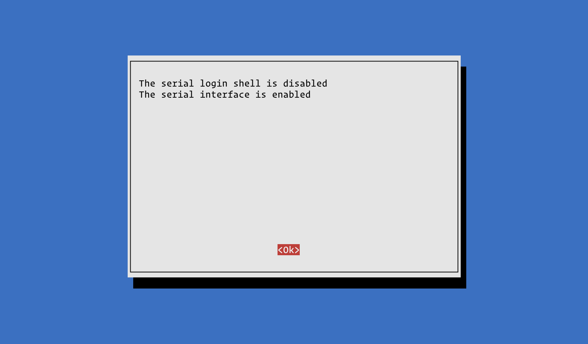

# Raspberry Pi 4 LTE router

Setup guide for building a simple LTE router using a Raspberry Pi 4 and an LTE modem such as the [Waveshare SIM7600](https://thepihut.com/products/4g-hat-for-raspberry-pi-lte-cat-4-3g-2g-with-gnss-positioning) hat.

## 1. Basic setup of the Pi

Install Raspberry Pi OS via your preferred route. Once logged into the new installation, update and upgrade:

```
:~ $ sudo apt update && sudo apt upgrade -y
```

Now configure the serial port with `raspi-config`:

```
:~ $ sudo raspi-config
```
Access the `Interface Options`:


Select `Serial Port`:


Choose `No` for `Would you like a login shell to be accessible over serial?:


Choose `Yes` for `Would you like the serial port hardware to be enabled?`:


You should then recieve a confirmation screen:



Whilst we're here we may as well update `raspi-config`:


Next, clone this respository to your home folder:

```
:~ $ git clone https://github.com/papalozarou/piRouter ~/
```

The last part of the basic setup is to disable `ModemManager` as it will automatically try to control the LTE modem:

```
:~ $ sudo systemctl unmask ModemManager.service
:~ $ sudo systemctl disable ModemManager.service
:~ $ sudo apt remove modemmanager -y
```

*N.B.*
The first line may not be needed, but is included just in case.

## 2. Secure the Pi

The next step is to secure the router with OpenSSH, UFW and Fail2Ban.

### 2.1 Hardening SSH access

The SSH server will be configured to:

1. only listen for ip4 connections;
2. change the listening port [a random port number between 20000 and 65535](https://www.random.org);
3. disable root login;
4. enable ssh keys;
5. disable password authentication; and
6. disable some other options.

Open the SSH daemon config file:

```
:~ $ sudo nano /etc/ssh/sshd_config
```

And edit and set the following lines – some of them may need uncommenting:

```
Port $[portNumber]
AddressFamily inet
[…]
LoginGraceTime 20
PermitRootLogin no
[…]
MaxAuthTries 3
[…]
PubkeyAuthentication yes
[…]
PasswordAuthentication no
PermitEmptyPasswords no
[…]
ChallengeResponseAuthentication no
[…]
KerberosAuthentication no
[…]
GSSAPIAuthentication no
[…]
AllowAgentForwarding no
[…]
X11Forwarding no
[…]
PermitUserEnvironment no
[…]
PermitTunnel no
```

Although [some guides recommend it](https://www.digitalocean.com/community/tutorials/how-to-harden-openssh-on-ubuntu-20-04), setting `AllowTcpForwarding` to `no` will mean you can't connect via Visual Studio Code.

Before restarting the SSH server, generate SSH keys on your local machine and add them to the Pi. The method of generating varies from OS to OS – Linode have [a great guide](https://www.linode.com/docs/guides/set-up-and-secure/).

On the Pi we need to set up the folder and file to store the public key, ensuring that the correct permissions are set on the server `.ssh` folder – `700` – and `authorized_keys` file – `600`:

```
:~ $ mkdir ~/.ssh
:~ $ touch ~/.ssh/authorized_keys
:~ $ chmod 700 ~/.ssh
:~ $ chmod 600 ~/.ssh/authorized_keys
:~ $ ls -lna ~/.ssh
drwx------ .
-rw------- authorized_keys
```

Paste the generated public key into `authorized_keys` and save. You can now restart the server:

```
sudo systemctl restart sshd
```

On your local machine add the server to your `ssh_config` or `config` file:

```
:~ $ nano ~/.ssh/ssh_config
```

And add the following, editing according to your setup:

```
Host ${connectionName}
  Hostname ${ipAddress} 
	Port ${portNumber} 
	User ${userName}
	IdentityFile ~/.ssh/${piRouterPrivateKeyFile}
```

You can now connect to your router via:

```
:~ $ ssh ${connectionName}
```

*N.B.*
Before closing the current session, check you can still login to your server by opening a new terminal session and testing the login details.

### 2.2 Setting up a firewall with UFW

By default, UFW is not installed as part of Raspberry Pi OS. Install it with:

```
sudo apt install ufw -y
```

Before making it active, you need to allow SSH connections on the port specified within `sshd_config`. First though stop it automatically adding ipv6 rules:

```
sudo nano /etc/default/ufw
```

And change `IPV6=yes` to the obvious:

```
IPV6=no
```

Now add the port number you specified in `sshd_config`:

```
sudo ufw allow $[portNumber]/tcp
```

For good measure we can explicitly deny traffic on port 22:

```
sudo ufw deny 22
```

Now enable UFW:

```
sudo ufw enable
```

Should you wish to, you can check UFW's status with:

```
sudo ufw status
```

### 2.3 Securing your router with Fail2Ban

As with UFW you will need to first install Fail2Ban:

```
sudo apt install fail2ban
```

By default, Fail2Ban reads `*.conf` files first, then `*.local` files which override any settings found in the `*.conf` files.

As you're not changing anything within the default `fail2ban.conf` you only need to create a jail config:

```
sudo cp /etc/fail2ban/jail.conf /etc/fail2ban/jail.local
```

Open the `jail.local` file:

```
sudo nano /etc/fail2ban/jail.local
```

Set the following lines – you may need to uncomment some of these lines to set them:

```
ignoreip = 127.0.0.1/8
[…]
bantime = 10m
[…]
findtime = 5m
[…]
maxretry = 3
```

Save and exit the config file. Now reload Fail2Ban:

```
sudo fail2ban-client reload
```

Should you wish to, you can check the status of Fail2Ban with:

```
sudo fail2ban-client status
```

### References
* [Digital Ocean's guide to hardening OpenSSH server](https://www.digitalocean.com/community/tutorials/how-to-harden-openssh-on-ubuntu-20-04)
* [Github thread on `.ssh` folder and file permissions](https://gist.github.com/grenade/6318301)
* [Linode's guide to instaling and configuring Fail2Ban](https://www.linode.com/docs/security/using-fail2ban-to-secure-your-server-a-tutorial/)


## 3. Set up the LTE modem

Now we need to set up and configure the LTE modem. Firstly you should run three checks to ensure the Pi can see it.

The first check is to make sure the modem is connected via USB:

```
:~ $ lsusb
Bus 002 Device 001: ID 1d6b:0003 Linux Foundation 3.0 root hub
Bus 001 Device 003: ID 1e0e:9001 Qualcomm / Option SimTech, Incorporated
Bus 001 Device 002: ID 2109:3431 VIA Labs, Inc. Hub
Bus 001 Device 001: ID 1d6b:0002 Linux Foundation 2.0 root hub
```

The second check is to make sure the modem appears as a CDC device, `cdc-wdm`:

```
:~ $ ls /dev/cdc*
/dev/cdc-wdm0
```

The third and final check is to make sure the modem appears as a network interface, `wwan0`:

```
:~ $ ip a
[…]
4: wwan0: […]
[…]
```

With the checks complete, you need to install the software necessary to communicate with the modem:

```
:~ $ sudo apt install libqmi-utils udhcpc -y
```

Before proceeding, ensure the modem is online:

```
:~ $ sudo qmicli -d /dev/cdc-wdm0 --dms-set-operating-mode='online'
[/dev/cdc-wdm0] Operating mode set successfully
```

Now set the modem's protocol to `raw_ip`:

```
:~ $ sudo ip link set wwan0 down
:~ $ echo 'Y' | sudo tee /sys/class/net/wwan0/qmi/raw_ip
Y
:~ $ sudo ip link set wwan0 up
```

Should you wish to, you can confirm the protocol is set by running:

```
:~ $ sudo qmicli -d /dev/cdc-wdm0 --wda-get-data-format
[…]
               Link layer protocol: 'raw-ip'
[…]
```

Some sims will require you to set the APN, username and password for your carrier. Some will not, though that may only be discovered via trial and error. If yours requires it, run:

```
qmicli -p -d /dev/cdc-wdm0 --device-open-net='net-raw-ip|net-no-qos-header' --wds-start-network="apn='${apn}',username='${username}',password='${password}',ip-type=4" --client-no-release-cid
```

If you recieve an error regarding multiple connections, you don't need to run this command.

Before you run the last command, make sure the device has started

```
:~ $ sudo qmi-network /dev/cdc-wdm0 start

```

The last step here is to connect the device to the carrier network and obtain an IP address:

```
:~ $ sudo udhcpc -q -f -i wwan0
udhcpc (v1.22.1) started
No resolv.conf for interface wwan0.udhcpc
Sending discover...
Sending select for X.X.X.X...
Lease of X.X.X.X obtained, lease time 7200
[…]
```

To confirm everything was successful run:

```
:~ $ ip a s wwan0
4: wwan0: <POINTOPOINT,MULTICAST,NOARP,UP,LOWER_UP> mtu 1500 qdisc pfifo_fast state UNKNOWN group default qlen 1000
    link/none 
    inet X.X.X.X/XX scope global wwan0
       valid_lft forever preferred_lft forever
```

As a lest check, ping Google, to ensure data is being recieved:

```
:~ $ ping -I wwan0 www.google.com -c 3
[…]
--- www.google.com ping statistics ---
3 packets transmitted, 3 received, 0% packet loss, time 4006ms
rtt min/avg/max/mdev = 31.199/46.540/58.827/8.962 ms
```

All of the above will need to be done again at every reboot. To avoid this, we will add the `/etc/network/interfaces.d/wwan0` file from this repo into `/etc/network/interfaces.d/`:

```
:~ $ sudo mv ~/piRouter//etc/network/interfaces.d/wwan0 /etc/network/interfaces.d/wwan0
```

If you require setting the APN, username, and password, uncomment that line. If you do not require it, you can delete it.

Reboot the Pi:

```
:~ $ sudo reboot
```

And check that everything has worked with:

```
:~ $ ip a s wwan0
4: wwan0: <POINTOPOINT,MULTICAST,NOARP,UP,LOWER_UP> mtu 1500 qdisc pfifo_fast state UNKNOWN group default qlen 1000
    link/none 
    inet X.X.X.X/XX scope global wwan0
       valid_lft forever preferred_lft forever
```

### References
* [Raspberry Pi forum thread on the Waveshare SIM7600](https://forums.raspberrypi.com/viewtopic.php?t=224355&sid=918970b6993605ed4f916180280bd04e#p1450784)
* [Jeff Geerling's blog post on setting up a Pi with an LTE modem](https://www.jeffgeerling.com/blog/2022/using-4g-lte-wireless-modems-on-raspberry-pi)

## 4. Connecting the modem to the ethernet port

Install `dnsmasq` so you can use it as a DHCP and DNS server:

```
:~ $ sudo apt install dnsmasq
```

Next set up the `eth0` interface by adding the `/etc/network/interfaces.d/eth0` file from this repo into `/etc/network/interfaces.d/`

```
:~ $ sudo mv ~/piRouter//etc/network/interfaces.d/eth0 /etc/network/interfaces.d/eth0
```

Now enable packet forwarding by editing `sysctl.conf`:

```
:~ $ sudo nano /etc/sysctl.conf
```

And uncomment the following line:

```
[…]
net.ipv4.ip_forward=1
[…]
```

Reboot the Pi for good measure:

```
:~ $ sudo reboot
```

Once the Pi comes back up, make the `wwan0-to-eth0.sh` script executable:

```
:~ $ chmod +x ~/piRouter/wwan0-to-eth0.sh
```

Now run the script:

```
:~ $ ./piRouter/wwan0-to-eth0.sh
```

If everything has been set up correctly, you will lose access to the Pi, though it's unclear why this happens.

To test if everything is working correctly, plug another machine directly into the Pi's ethernet port and, in the machine's network settings, set DHCP to mannual with the following values:

```
IP address: 192.168.2.5
Subnet mask: 255.255.255.0
Router: 192.168.2.1
```

Turn your machine's wifi off, open a browser and you should be able to browse the web, via the Pi's LTE connection.

### References
* [StackExchange thread on accessing Pi Wifi connection via it's ethernet port](https://raspberrypi.stackexchange.com/questions/48307/sharing-the-pis-wifi-connection-through-the-ethernet-port)
* [arpitjindal97's script linked from the above thread](https://github.com/arpitjindal97/raspbian-recipes/blob/master/wifi-to-eth-route.sh)


